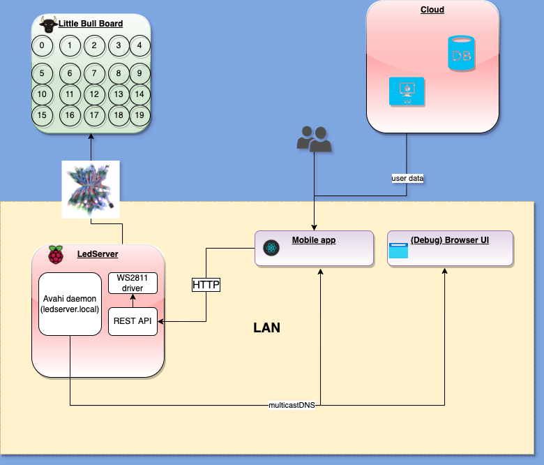

# Little Bull Climbing System



## Local setup

### Client
- install the expo-cli
```bash
npm install -g expo-cli
```
- we should also install the expo dependencies. This can be done by running `expo install`
- now `cd` into `lbcsClient` repo and type `npm start`
- you can either emulate the app using the expo app from play store [here](https://play.google.com/store/apps/details?id=host.exp.exponent&hl=en) or from the app store [here](https://apps.apple.com/nl/app/expo-client/id982107779)
- you can also use the various browsers to emulate the app client using android studio [here](https://docs.expo.io/workflow/android-studio-emulator/)

### ledserver and backend

`docker-compose up`

makes the backend available at `9999` and the ledserver at `8888`

The ledserver has a simple HTML UI which simulates the changes applied to the board.